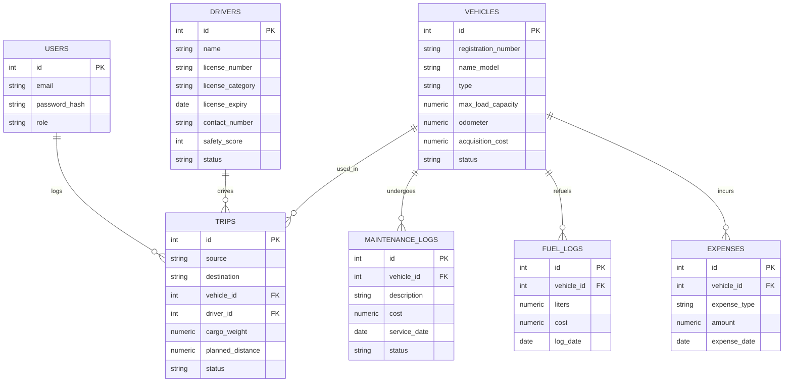

# FleetPulse

**Smart Transport Operations Platform** — built for the Odoo Hackathon (TransitOps problem statement)

FleetPulse replaces spreadsheets and paper logbooks with a single operational system for
managing a delivery fleet: vehicles, drivers, trips, maintenance, fuel, and expenses — with
role-based access and business rules enforced server-side, not just hinted at in the UI.

---

## Table of contents

- [Problem statement](#problem-statement)
- [What's implemented](#whats-implemented)
- [Business rules](#business-rules-enforced-server-side)
- [Tech stack](#tech-stack)
- [Architecture](#architecture)
- [Data model / ER diagram](#data-model)
- [Roles & permissions](#roles--permissions)
- [Getting started](#getting-started)
- [API reference](#api-reference)
- [Project structure](#project-structure)
- [Demo](#demo)
- [Team](#team)

---

## Problem statement

Many logistics operators still run fleets on spreadsheets and manual logs — leading to
scheduling conflicts, underused vehicles, missed maintenance windows, expired driver licenses,
and no real visibility into operating cost. FleetPulse centralizes the full lifecycle: register
a vehicle → assign a driver → dispatch a trip → log fuel and maintenance → see the cost and
utilization roll up on a live dashboard, with the system itself blocking invalid states instead
of trusting the user to avoid them.

## What's implemented

Every item below is a working feature, not a mock — each links to the file that implements it.

| Screen | Status | Backend | Frontend |
|---|---|---|---|
| Authentication (RBAC) | ✅ | [`routes/auth.js`](backend/routes/auth.js) | [`pages/Login.jsx`](frontend/src/pages/Login.jsx) |
| Dashboard (live KPIs) | ✅ | [`routes/reports.js`](backend/routes/reports.js) | [`pages/Dashboard.jsx`](frontend/src/pages/Dashboard.jsx) |
| Vehicle Registry | ✅ | [`routes/vehicles.js`](backend/routes/vehicles.js) | [`pages/Vehicles.jsx`](frontend/src/pages/Vehicles.jsx) |
| Drivers & Safety Profiles | ✅ | [`routes/drivers.js`](backend/routes/drivers.js) | [`pages/Drivers.jsx`](frontend/src/pages/Drivers.jsx) |
| Trip Dispatcher | ✅ | [`routes/trips.js`](backend/routes/trips.js) | [`pages/Trips.jsx`](frontend/src/pages/Trips.jsx) |
| Maintenance | ✅ | [`routes/maintenance.js`](backend/routes/maintenance.js) | [`pages/Maintenance.jsx`](frontend/src/pages/Maintenance.jsx) |
| Fuel & Expense Management | ✅ | [`routes/fuelExpenses.js`](backend/routes/fuelExpenses.js) | [`pages/FuelExpenses.jsx`](frontend/src/pages/FuelExpenses.jsx) |
| Reports & Analytics | ✅ | [`routes/reports.js`](backend/routes/reports.js) | [`pages/Analytics.jsx`](frontend/src/pages/Analytics.jsx) |
| Settings & RBAC | ✅ | enforced across all routes via [`middleware/auth.js`](backend/middleware/auth.js) | [`pages/Settings.jsx`](frontend/src/pages/Settings.jsx) |

**Mandatory deliverables checklist (from the problem statement):**

- [x] Responsive web interface
- [x] Authentication with RBAC (4 roles, JWT-based)
- [x] CRUD for Vehicles and Drivers
- [x] Trip Management with validations
- [x] Automatic status transitions (vehicle/driver ↔ trip ↔ maintenance)
- [x] Maintenance workflow
- [x] Fuel & Expense tracking
- [x] Dashboard with KPIs
- [ ] Charts and visual analytics *(tabular analytics implemented; charting library not yet wired in)*
- [ ] PDF export *(optional per spec — not implemented)*
- [ ] Email reminders for expiring licenses *(bonus — not implemented)*
- [ ] Vehicle document management *(bonus — not implemented)*
- [x] Search, filters, and sorting *(status filters on Vehicles/Drivers)*
- [ ] Dark mode *(app ships dark-only by design — no light-mode toggle)*

## Business rules enforced server-side

These are checked in the backend on every request — not just hidden in the UI — so they hold
even if someone hits the API directly.

1. **Vehicle registration number is unique** — [`routes/vehicles.js`](backend/routes/vehicles.js)
2. **Driver license number is unique** — [`routes/drivers.js`](backend/routes/drivers.js)
3. **Retired / In Shop vehicles never appear in dispatch selection** — `GET /vehicles/dispatchable` only returns `Available`
4. **Suspended drivers or expired licenses can't be assigned to a trip** — checked at dispatch time in [`routes/trips.js`](backend/routes/trips.js)
5. **A vehicle or driver already `On Trip` can't be assigned to another trip** (no double-booking)
6. **Cargo weight can't exceed the vehicle's max load capacity** — validated before dispatch
7. **Dispatching a trip atomically sets both vehicle and driver to `On Trip`** — wrapped in a DB transaction ([`withTransaction`](backend/db/db.js)) so it can't half-apply
8. **Completing or cancelling a trip restores vehicle and driver to `Available`**
9. **Creating an active maintenance record sets the vehicle to `In Shop`**, removing it from dispatch
10. **Closing a maintenance record restores `Available`** — unless the vehicle is `Retired`, which stays retired
11. **Role-based access control** on every mutating endpoint (e.g. only `FleetManager` can register a vehicle; only `Dispatcher`/`FleetManager` can dispatch a trip) — see the [permissions table](#roles--permissions)

## Tech stack

| Layer | Choice | Why |
|---|---|---|
| Frontend | React (Vite) + React Router + Axios | Fast dev loop, no unnecessary framework overhead |
| Backend | Node.js + Express | Team familiarity, quick to iterate under hackathon time pressure |
| Database | PostgreSQL (`pg`, no ORM) | Real relational integrity for status transitions; raw parameterized SQL keeps query logic transparent and auditable |
| Auth | JWT + bcrypt | Stateless auth, standard for a small API |
| Styling | Custom CSS design system (no UI framework) | See [Design](#design) — deliberate visual identity rather than a default component-library look |

No AI-generated code was used without review — every business rule above was tested against the
scenarios described in the problem statement before being considered done (see [Getting
started](#getting-started) for how to verify this yourself).

## Design

FleetPulse uses a **dispatch control room** visual language rather than a generic admin-panel
theme: a charcoal-navy base, highway-amber accents, condensed display type for headers, and
monospace type for all registration numbers, license numbers, and IDs. The signature element is
the **status rail** — a colored left-edge strip on every card and table row, keyed consistently
to vehicle/driver/trip status across all 9 screens, so operational state is readable at a glance
without reading text. Full token system in [`frontend/src/styles.css`](frontend/src/styles.css).

## Architecture

```
┌─────────────┐      HTTPS/JSON       ┌──────────────┐      SQL       ┌────────────┐
│   React SPA │ ───────────────────▶  │  Express API │ ─────────────▶ │ PostgreSQL │
│   (Vite)    │ ◀───────────────────  │   (Node.js)  │ ◀───────────── │            │
└─────────────┘      JWT in header    └──────────────┘   pg pool      └────────────┘
```

- **Frontend** talks to the backend only through `frontend/src/api/client.js`, a single Axios
  instance that auto-attaches the JWT to every request.
- **Backend** is organized one route file per resource (`routes/vehicles.js`, `routes/trips.js`,
  etc.), each guarded by `requireAuth` + `requireRole` middleware.
- **Database** access is raw parameterized SQL via `pg` — no ORM — with a `withTransaction()`
  helper wrapping any operation that touches more than one table, so a dispatch or maintenance
  action can't leave the system in a half-updated state if it fails partway through.

## Data model



Full schema with constraints in [`backend/db/db.js`](backend/db/db.js).

## Roles & permissions

| Module | Fleet Manager | Dispatcher | Safety Officer | Financial Analyst |
|---|:---:|:---:|:---:|:---:|
| Dashboard | View | View | View | View |
| Fleet (Vehicles) | Edit | View | — | — |
| Drivers | Edit | View | Edit | — |
| Trips | Edit | Edit | View | — |
| Maintenance | Edit | — | — | — |
| Fuel & Expenses | Edit | Edit | — | Edit |
| Analytics | View | — | — | View |

Enforced in [`backend/middleware/auth.js`](backend/middleware/auth.js) and applied per-route —
see [`pages/Settings.jsx`](frontend/src/pages/Settings.jsx) for the in-app reference view.

## Getting started

### 1. Get a PostgreSQL database
- **Free hosted (recommended — zero install)**: [Neon](https://neon.tech) or
  [Supabase](https://supabase.com), free tier, copy the connection string
- **Local**: `createdb fleetpulse` after installing Postgres
- **Docker**: `docker run --name fleetpulse-db -e POSTGRES_PASSWORD=postgres -e POSTGRES_DB=fleetpulse -p 5432:5432 -d postgres:16`

### 2. Backend
```bash
cd backend
cp .env.example .env      # then paste your DATABASE_URL in
npm install
npm start
```
Runs on `http://localhost:4000`. Tables and 4 demo accounts (one per role) are created
automatically on first run.

| Role | Email | Password |
|---|---|---|
| Fleet Manager | fleetmanager@fleetpulse.in | password123 |
| Dispatcher | dispatcher@fleetpulse.in | password123 |
| Safety Officer | safety@fleetpulse.in | password123 |
| Financial Analyst | finance@fleetpulse.in | password123 |

### 3. Frontend
```bash
cd frontend
npm install
npm run dev
```
Runs on `http://localhost:5173`, proxies `/api` to the backend.

### Verifying the business rules yourself
1. Log in as Fleet Manager, register a vehicle with a small max load capacity (e.g. 100kg)
2. Log in as Dispatcher, create a trip against that vehicle with cargo weight over 100kg → dispatch is rejected with the exact capacity numbers in the error
3. Create a valid trip, dispatch it → the vehicle disappears from the dispatch pool immediately (it's now `On Trip`)
4. Complete or cancel the trip → the vehicle reappears as `Available`
5. Log maintenance on that vehicle → it flips to `In Shop`; close it → back to `Available`

## API reference

Base URL: `/api`. All routes except `/auth/login` require `Authorization: Bearer <token>`.

| Method | Route | Purpose | Roles |
|---|---|---|---|
| POST | `/auth/login` | Get a JWT | Public |
| GET | `/auth/me` | Current user | Any |
| GET | `/vehicles` | List vehicles | Any |
| GET | `/vehicles/dispatchable` | Available vehicles only | Any |
| POST | `/vehicles` | Register vehicle | Fleet Manager |
| PATCH | `/vehicles/:id/status` | Override status | Fleet Manager |
| GET | `/drivers` | List drivers | Any |
| GET | `/drivers/dispatchable` | Eligible drivers only | Any |
| POST | `/drivers` | Add driver | Fleet Manager, Safety Officer |
| PATCH | `/drivers/:id/status` | Suspend/reinstate | Fleet Manager, Safety Officer |
| GET | `/trips` | List trips | Any |
| POST | `/trips` | Create draft trip | Dispatcher, Fleet Manager |
| POST | `/trips/:id/dispatch` | Dispatch (validates all rules) | Dispatcher, Fleet Manager |
| POST | `/trips/:id/complete` | Complete trip | Dispatcher, Fleet Manager |
| POST | `/trips/:id/cancel` | Cancel trip | Dispatcher, Fleet Manager |
| GET | `/maintenance` | List records | Any |
| POST | `/maintenance` | Log service (→ In Shop) | Fleet Manager |
| POST | `/maintenance/:id/close` | Close (→ Available) | Fleet Manager |
| GET / POST | `/fuel-expenses/fuel` | Fuel logs | Any / Fleet Manager, Dispatcher |
| GET / POST | `/fuel-expenses/expenses` | Toll/misc expenses | Any / Fleet Manager, Financial Analyst |
| GET | `/reports/dashboard` | KPI summary | Any |
| GET | `/reports/analytics` | Per-vehicle cost/efficiency/ROI | Any |

## Project structure

```
FleetPulse/
├── backend/
│   ├── db/db.js              # schema + seed data
│   ├── middleware/            # auth.js (JWT+RBAC), asyncHandler.js
│   ├── routes/                # one file per resource
│   └── server.js
└── frontend/
    └── src/
        ├── api/                # client.js (axios), AuthContext.jsx
        ├── components/Layout.jsx
        ├── pages/              # one file per screen
        └── styles.css          # design system
```

## Demo

- **Video walkthrough:** 
- **Live deployment:** 
- **Repository:** https://github.com/safwanshk11/FleetPulse

## Team

| Name | Focus area |
|---|---|
| _[S Sreekuttan]_ | Fleet & Assets — Vehicle Registry, Maintenance, Settings & RBAC |
| _[Safwan Shaik]_ | People & Trips — Auth, Drivers, Trip Dispatcher |
| _[Yashwini Priya Prabhu]_ | Money & Insights — Dashboard, Fuel & Expenses, Analytics |

Built for the **Odoo Hackathon** — TransitOps: Smart Transport Operations Platform.
